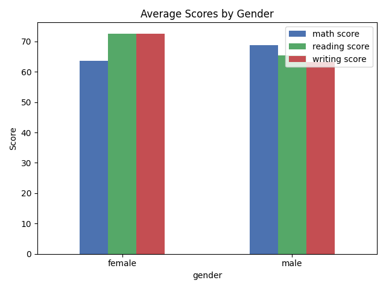
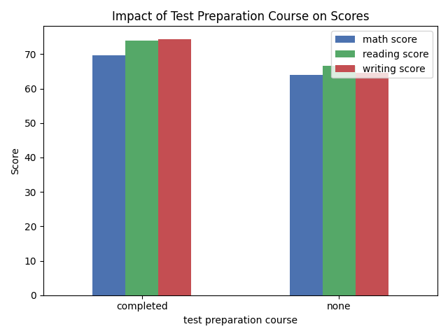
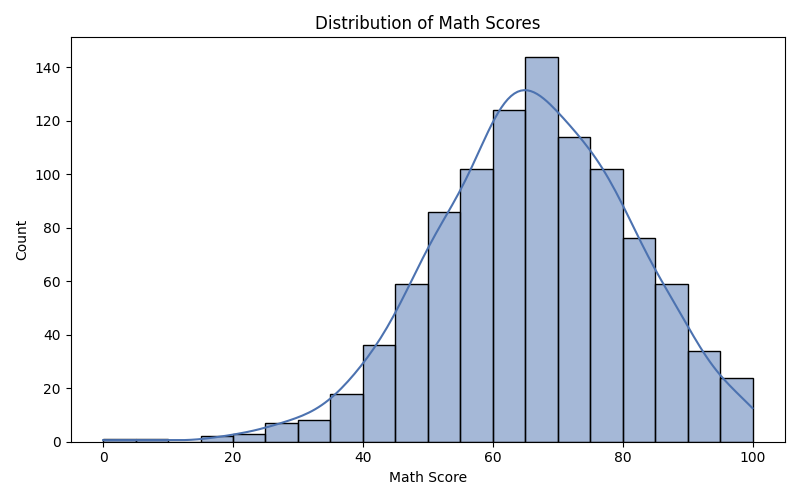

# 🎓 Student Performance Analysis

A data analysis and machine learning project that explores factors affecting 
student exam scores and predicts math performance using Python.

## 📊 Dataset
- 1000 students, 8 features
- Source: Kaggle — Students Performance in Exams
- Features: gender, race/ethnicity, parental education, lunch, 
  test preparation, math/reading/writing scores

## 🔍 Key Findings
- Students who completed test preparation scored higher across all subjects
- Parental education level positively impacts student performance
- The ML model predicts math scores with 88% accuracy (R² = 0.88)

## 📈 Visualizations
### Average Scores by Gender

### Impact of Test Preparation Course

### Distribution of Math Scores

## 🤖 Machine Learning Model
- **Algorithm:** Linear Regression
- **Target:** Math score prediction
- **R² Score:** 0.88 (88% accurate)
- **Mean Absolute Error:** 4.19 marks

## 🛠️ Tools Used
- Python
- Pandas
- Matplotlib
- Seaborn
- Scikit-learn

## 🚀 How to Run
1. Clone this repository
2. Install dependencies: `pip install pandas matplotlib seaborn scikit-learn`
3. Run: `python analysis.py`

## 👤 Author
B.Tech CSE (AIML) — 2nd Year
